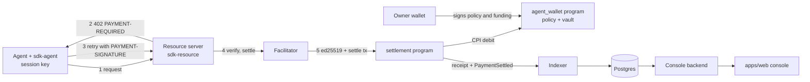

# Turnstile

Turnstile lets software pay for what it uses, one HTTP request at a time, inside limits its owner sets in advance.
Payments settle in a stablecoin on Solana, follow the x402 v2 transport, and the spending policy is enforced by the Solana programs, not by any server.

## How the pieces fit

An agent calls a paid route. The route answers 402. The agent signs a payment with a scoped session key and retries. The facilitator settles it on chain and the route serves the answer.

- `programs/agent-wallet` holds the funds in a vault, stores the policy (per-call cap, rolling daily cap, allow-list) and the session keys, and debits only when the settlement program asks.
- `programs/settlement` checks the session key signature, spends the nonce, calls `debit` and writes a receipt, all in one instruction.
- `packages/facilitator` issues payment requirements, verifies payloads and submits settlement transactions. Its key pays fees and cannot move agent funds.
- `packages/sdk-resource` turns a Hono, Express or plain `node:http` route into a paid route.
- `packages/sdk-agent` pays a 402 automatically and refuses anything outside the policy before it signs.
- `packages/demo-api` is a metered text API plus the demo agent runner behind the live demo.
- `packages/indexer` copies receipts from the chain into Postgres and resumes from a checkpoint.
- `packages/backend` serves the console. It builds unsigned owner transactions, issues API keys and reads the indexer store.
- `packages/shared` holds program ids, IDLs, the authorization encoding, config and migrations.
- `apps/web` is the marketing site, the docs, the console and the live demo.



The chain is the source of truth for funds, policy, session keys and receipts. See [docs/SYSTEM_DESIGN.md](docs/SYSTEM_DESIGN.md) for the contract and [docs/SECURITY.md](docs/SECURITY.md) for the trust boundaries.

## Repository layout

| Path | What it holds |
| --- | --- |
| `programs/agent-wallet`, `programs/settlement` | Anchor programs. LiteSVM tests live in `programs/settlement/tests` |
| `packages/shared` | Program client, IDLs, authorization encoder, policy mirror, migrations, localnet bootstrap |
| `packages/facilitator` | x402 facilitator service, dead letter replay, receipt rent reclaim |
| `packages/sdk-resource`, `packages/sdk-agent` | The two SDKs |
| `packages/demo-api` | Metered demo API (`main.ts`) and demo agent runner (`agent-main.ts`) |
| `packages/indexer`, `packages/backend` | Receipt indexer and console backend |
| `packages/e2e` | End to end suite against a running stack |
| `apps/web` | Next.js site, docs, console and live demo. Browser checks in `apps/web/e2e` |
| `infra/` | Docker compose, validator and Node images, stack and e2e scripts, CI helpers |
| `docs/` | System design, API, runbook, security, test plan, frontend spec, ADRs |
| `keys/`, `deployments/` | Local keypairs (git ignored) and deployment records written by the bootstrap |

## Prerequisites

- Node 22 (CI pins 22.23.2) and pnpm 11 (`npm install -g pnpm@11.24.0`).
- Rust (CI pins 1.98.1).
- Agave 4.0.2, which provides `solana-test-validator`, `cargo build-sbf` and the `solana` CLI.
- Anchor 1.2.0, only if you want `anchor` commands. The scripts use `cargo build-sbf` directly.
- Docker with the compose plugin, for Postgres on port 5433 and the full stack.

## Fastest local run

Build and run everything in Docker. The script builds the programs first when `target/deploy` is empty.

```sh
pnpm install
pnpm stack:up
```

The site is then on http://localhost:3000, the demo on http://localhost:3000/demo and the services on ports 4020 to 4024. Stop it with `pnpm stack:down`.

To run the services from a shell instead, start only the chain and the database, then start each service with the variables the script prints.

```sh
pnpm dev:up             # validator and postgres in docker
pnpm dev:up --native    # solana-test-validator on this machine, postgres in docker
```

[docs/RUNBOOK.md](docs/RUNBOOK.md) has the ports, every service command and the recovery steps.

## Tests

```sh
cargo test -p settlement -p agent-wallet              # program tests in LiteSVM, needs target/deploy/*.so
pnpm build
pnpm -r --filter '!@turnstile/e2e' run test           # unit tests, needs Postgres on 5433
TURNSTILE_INTEGRATION=1 pnpm --filter @turnstile/sdk-resource test   # real validator and facilitator
pnpm e2e                                              # full stack and the end to end suite
E2E_STACK=infra pnpm e2e                              # what CI runs
```

Root `pnpm test` also runs `@turnstile/e2e`, which needs a running stack. [docs/TESTPLAN.md](docs/TESTPLAN.md) maps every requirement to its tests.

## Documentation

- [docs/SCOPE.md](docs/SCOPE.md) for goals, non-goals and requirements.
- [docs/SYSTEM_DESIGN.md](docs/SYSTEM_DESIGN.md) for accounts, instructions, errors and the x402 interface.
- [docs/API.md](docs/API.md) for the facilitator, SDKs, console backend and demo runner.
- [docs/RUNBOOK.md](docs/RUNBOOK.md) for running, deploying and recovering.
- [docs/SECURITY.md](docs/SECURITY.md) for the threat model and the program review findings.
- [docs/TESTPLAN.md](docs/TESTPLAN.md) for the requirement to test matrix.
- [docs/FRONTEND_SPEC.md](docs/FRONTEND_SPEC.md) for the design system and page inventory.
- [docs/adr](docs/adr) for the decisions behind the design.
- Package READMEs in `packages/*/README.md` for each service in depth.

## Program ids

| Program | Id |
| --- | --- |
| agent_wallet | `7onzUVc1HGc9oBDUspBdP8dz1QW6uXrSdBn4NH6aiLb` |
| settlement | `6FrY43zorjSv8wCuarPL3z8ZnyBTyyC86xRjBqgu1K9z` |

The same ids are used on the local validator and on devnet. They are not deployed to devnet yet.

## Status

Everything below was proven on a local `solana-test-validator` (Agave 4.0.2). Nothing has run on a public cluster.

Proven locally.

- The full loop from 402 to a receipt on chain that matches the indexer row field by field (`packages/e2e/test/product-loop.test.ts`).
- An over-cap payment, an off allow-list payment and a replayed nonce each fail inside the program when sent straight to it, bypassing the facilitator and the SDK.
- The live demo run settles six calls and the chain refuses the seventh with `DailyCapExceeded`.
- The indexer survives a SIGKILL mid-stream with no gap and no duplicate, and restarts cleanly after a ledger reset.
- Receipt rent reclaim with `close_receipt` after the 7 day retention, including a replay after close that fails as expired and moves no funds (LiteSVM).

Measured numbers, with their conditions.

- `settle` uses about 47k to 53k compute units in the LiteSVM tests. The spread comes from PDA bump searches. Runs on 30 Sep 2026 read 48,907, 51,907 and 53,407.
- `close_receipt` uses 4,155 compute units and returns 3,180,720 lamports of rent.
- Paid request median about 440 ms (455 ms and 427 ms in two runs of 25) from `packages/sdk-resource/test/integration.test.ts` on a lightly loaded WSL2 host, from the [facilitator README](packages/facilitator/README.md).
- The e2e latency run (`packages/e2e/test/latency.test.ts`) failed its 2,000 ms budget with a 2.9 s median and a 4.0 s p90. That run had a 1 minute load average of about 87 on 8 CPUs. NFR3 is therefore not proven under load.

UNVERIFIED. Each item and the step that clears it is in [BLOCKERS.md](BLOCKERS.md).

- Devnet deploy of both programs. The deployer has no devnet SOL.
- The web app on Vercel and public hosting of the services.
- NFR3 latency under load.
- Frontend performance on mobile. Lighthouse mobile performance on the home page measured 82 to 88 across runs, and only the home page was measured.
- The console with a real browser extension wallet. The browser tests use a test-only Wallet Standard wallet.
- Receipt reclaim on a validator after a real 7 day wait. The validator run used preloaded receipts.
- The validator image built from the Agave release download.
